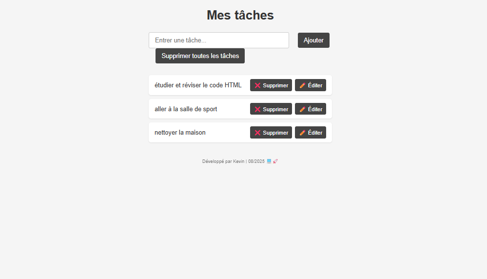

# 📝 Gestionnaire de Tâches

## ✨ Fonctionnalités

✅ Ajouter, éditer et supprimer des tâches

✔️ Marquer les tâches comme complétées

💾 Sauvegarde automatique (localStorage)

⚠️ Validation des doublons

🎯 Interface responsive

## 🚀 Utilisation

Ajouter : Saisissez et cliquez "Ajouter"

Compléter : Cliquez sur le texte

Éditer : Double-clic sur le texte ou bouton ✏️

Supprimer : Bouton ❌ ou "Tout supprimer"

## 🛠️ Stack

HTML5 - Structure de l'application

CSS3 - Styles et design responsive

JavaScript ES6+ - Logique et interactivité

Flexbox - Mise en page moderne

Les données sont persistées dans le navigateur using:

- **localStorage** (Web Storage API)
- **Sérialisation JSON** pour les objets JavaScript

## 📦 Installation

```bash
git clone https://github.com/kevinh-dev/project-mini-challenge.git
```

Ouvrez index.html dans votre navigateur.

## 👨‍💻 Auteur

**Kevin Henrique** - [LinkedIn](https://www.linkedin.com/in/kevin-henrique-cavalcante-gomes-747785330/) - [GitHub](https://github.com/kevinh-dev)

## 📸 Preview


